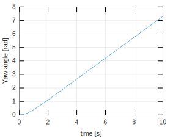
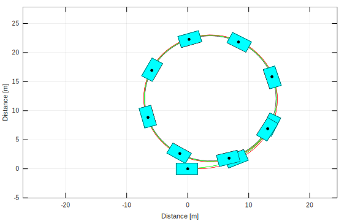

.. _skidpad:

SkidPad
********************************************************************************

This example shows the maneuver of a nonlinear simple vehicle with Pacejka tire model moving in circles.

The main script is described in :ref:`skidpad-script`. A control law (rear-wheel-drive) is used to maintain a constant CG speed. The control is implemented in the :ref:`velcontrol-skidpad` file.

.. _skidpad-script:

SkidPad.m
================================================================================

First, we choose the tire and vehicle models. The first one is the Pacejka tire model (:ref:`tire-pacejka`) and the second one is the nonlinear vehicle model (:ref:`vehicle-simple-3dof`).

.. code-block:: matlab
    
    TireModel = TirePacejka();          % Choosing tire
    System = VehicleSimpleNonlinear();  % Choosing vehicle
    
The default parameters of the vehicle and tire model can be seen in :mod:`VehicleSimpleNonlinear` and :mod:`TirePacejka`, respectively.

Changing the vehicle parameters

.. code-block:: matlab
    
    System.mF0 = 700;
    System.mR0 = 600;
    System.IT = 10000;
    System.lT = 3.5;
    System.nF = 2;
    System.nR = 2;
    System.wT = 2;
    System.muy = .8;
    
Check all the vehicle parameters at :mod:`VehicleSimpleNonlinear`.

The input variables can be defined as

.. code-block:: matlab
    
    System.deltaf = 20*pi/180;
    System.Fxf = 0;
    System.Fxr = @VelControl;
    
When the input variables are defined as a scalar quantity, the attributed value remains the same for the entire simulation span. However, we can see that the longitudinal force of the rear axle recieves the handle of the :ref:`velcontrol-skidpad` function.

The System is completely defined once we attribute the chosen tire model to the vehicle object.

.. code-block:: matlab
    
    System.tire = TireModel;
    
Choosing the simulation time span

.. code-block:: matlab
    
    T = 10;                             % Total simulation time [s]
    resol = 100;                        % Resolution
    TSPAN = 0:T/resol:T;                % Time span [s]
    
To define a simulation object (:mod:`Simulator`) the arguments must be the vehicle object and the time span.

.. code-block:: matlab
    
    simulator = Simulator(System, TSPAN);
    
The initial velocity of the center of gravity can be changed running

.. code-block:: matlab
    
    simulator.V0 = 8.333;
    
Now, we have everything needed to run the simulation. For this, we use

.. code-block:: matlab
    
    simulator.Simulate();
    
The resulting time response of each state is stored in separate variables:

.. code-block:: matlab
    
    XT = simulator.XT;
    YT = simulator.YT;
    PSI = simulator.PSI;
    VEL = simulator.VEL;
    ALPHAT = simulator.ALPHAT;
    dPSI = simulator.dPSI;
    
The following lines plot the time response of each state of the model.

.. code-block:: matlab
    
    f1 = figure(1);
    hold on ; grid on ; box on
    plot(TSPAN,XT)
    xlabel('time [s]')
    ylabel('Distance in the x direction [m]')
    
    f2 = figure(2);
    hold on ; grid on ; box on
    plot(TSPAN,YT)
    xlabel('time [s]')
    ylabel('Distance in the y direction [m]')
    
    f3 = figure(3);
    hold on ; grid on ; box on
    plot(TSPAN,PSI)
    xlabel('time [s]')
    ylabel('Yaw angle [rad]')
    
    f4 = figure(4);
    hold on ; grid on ; box on
    plot(TSPAN,VEL)
    xlabel('time [s]')
    ylabel('Velocity [m/s]')
    
    f5 = figure(5);
    hold on ; grid on ; box on
    plot(TSPAN,ALPHAT)
    xlabel('time [s]')
    ylabel('Vehicle slip angle [rad/s]')
    
    f6 = figure(6);
    hold on ; grid on ; box on
    plot(TSPAN,dPSI)
    xlabel('time [s]')
    ylabel('Yaw rate [rad/s]')
    
The generated figures can be seen below.

    Longitudinal position of the center of gravity of the system.

.. figure::  ../illustrations/plot/SkidPadFig2.svg
    :align:   center
    :width: 40%

    Transversal position of the center of gravity of the system.

    Yaw angle of the vehicle

.. figure::  ../illustrations/plot/SkidPadFig4.svg
    :align:   center
    :width: 40%

    Velocity of the center of gravity

.. figure::  ../illustrations/plot/SkidPadFig5.svg
    :align:   center
    :width: 40%

    Vehicle slip angle

.. figure::  ../illustrations/plot/SkidPadFig6.svg
    :align:   center
    :width: 40%

    Vehicle yaw rate

Frame and animation can be generated defining a graphic object (:mod:`Graphics`). The only argument of the graphic object is the simulator object after the simulation.

.. code-block:: matlab
    
    g = Graphics(simulator);
    
To change the color of the vehicle run

.. code-block:: matlab
    
    g.TractorColor = 'c';
    
The frame can be generated running

.. code-block:: matlab
    
    g.Frame();
    
We can fit a circle to verify the trajectory of the center of gravity. This is done using the function :ref:`circfit-skidpad`

.. code-block:: matlab
    
    angulo = 0:0.01:2*pi;
    
    [R,XC,YC] = circfit(XT(40:end),YT(40:end));
    
    XX = XC + R*cos(angulo);
    YY = YC + R*sin(angulo);
    
    hold on
    plot(XX,YY,'k')
    
The animation can be generated running

.. code-block:: matlab
    
    g.Animation();
    
Both graphics feature can be seen below.

    Frame of the simple vehicle model.

.. figure::  ../illustrations/animation/SkidPadAnimation.gif
    :align:   center

    Animation of the simple vehicle model.

.. _velcontrol-skidpad:

VelControl.m
================================================================================

The control law of the longitudinal system is depicted below.

.. literalinclude:: ../../doc/examples/SkidPad/VelControl.m

.. _circfit-skidpad:

circfit.m
================================================================================

The function used do fit a circle is depicted below.

.. literalinclude:: ../../doc/examples/SkidPad/circfit.m
