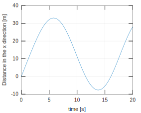
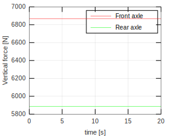

.. _skidpad-4dof:

SkidPad 4DOF
********************************************************************************

This example shows the maneuver of a nonlinear simple vehicle 4 DOF with Pacejka tire model moving in circles.

The main script is described in :ref:`skidpad-4dof-script`. A control law (rear-wheel-drive) is used to maintain a constant CG speed. The control is implemented in the :ref:`velcontrol-skidpad-4dof` file.

.. _skidpad-4dof-script:

SkidPad4DOF.m
================================================================================

First, we choose the tire and vehicle models. The first one is the Pacejka tire model (:ref:`tire-pacejka`) and the second one is the nonlinear vehicle model (:ref:`vehicle-simple-4dof`).

.. code-block:: matlab
    
    TireModel = TirePacejka();              % Choosing tire
    System = VehicleSimpleNonlinear4DOF();  % Choosing vehicle
    
The default parameters of the vehicle and tire model can be seen in :mod:`VehicleSimpleNonlinear` and :mod:`TirePacejka`, respectively.

Changing the vehicle parameters

.. code-block:: matlab
    
    System.mF0 = 700;
    System.mR0 = 600;
    System.lT = 3.5;
    System.nF = 1;
    System.nR = 1;
    System.wT = 2;
    System.muy = 1;
    System.deltaf = 10*pi/180;
    System.H = 0.6;                     % CG height [m]
    System.L = 0.6;                     % track [m]
    System.IXX = 12000;
    System.IYY = 65000;
    System.IZZ = 65000;
    System.IXY = 1000;
    System.IXZ = 1000;
    System.IYZ = 1000;
    System.K = 50000000;                % Torcional stiffness
    System.C = 5000000;
    
Check all the vehicle parameters at :mod:`VehicleSimpleNonlinear4DOF`.

The input variables can be defined as

.. code-block:: matlab
    
    System.FXFRONTLEFT = 0;
    System.FXFRONTRIGHT = 0;
    System.FXREARLEFT = @VelControl4DOF;
    System.FXREARRIGHT = @VelControl4DOF;
    
When the input variables are defined as a scalar quantity, the attributed value remains the same for the entire simulation span. However, we can see that the longitudinal force of the rear tires recieve the handle of the :ref:`velcontrol-skidpad-4dof` function.

The System is completely defined once we attribute the chosen tire model to the vehicle object.

.. code-block:: matlab
    
    System.tire = TireModel;
    
Choosing the simulation time span

.. code-block:: matlab
    
    T = 20;                             % Total simulation time [s]
    resol = 200;                        % Resolution
    TSPAN = 0:T/resol:T;                % Time span [s]
    
To define a simulation object (:mod:`Simulator`) the arguments must be the vehicle object and the time span.

.. code-block:: matlab
    
    simulator = Simulator(System, TSPAN);
    
The initial velocity of the center of gravity can be changed running

.. code-block:: matlab
    
    simulator.V0 = 8;
    
Now, we have everything needed to run the simulation. For this, we use

.. code-block:: matlab
    
    simulator.Simulate();
    
The resulting time response of each state is stored in separate variables:

.. code-block:: matlab
    
    XT = simulator.XT;
    YT = simulator.YT;
    PSI = simulator.PSI;
    THETA = simulator.THETA;
    VEL = simulator.VEL;
    ALPHAT = simulator.ALPHAT;
    dPSI = simulator.dPSI;
    dTHETA = simulator.dTHETA;
    
Retrieving data from vehicle:

.. code-block:: matlab
    
    m = System.mT;
    a = System.a;
    b = System.b;
    K = 50000000;                       % Torcional stiffness of the sprung mass
    CC = 5000000;
    h = 0.6;                            % CG height [m]
    l = 0.6;                            % track [m]
    g = 9.81;
    
Calculating the vertical force at each tire

.. code-block:: matlab
    
    FzRight = (m*g*l/2 + K*THETA + CC*dTHETA)/l;
    FzLeft = m*g - FzRight;
    
    FzFrontRight = FzRight*b/(a+b);
    FzFrontLeft = FzLeft*b/(a+b);
    FzRearRight = FzRight*a/(a+b);
    FzRearLeft = FzLeft*a/(a+b);
    
The following lines plot the time response of each state of the model.

.. code-block:: matlab
    
    f1 = figure(1);
    hold on ; grid on ; box on
    plot(TSPAN,XT)
    xlabel('time [s]')
    ylabel('Distance in the x direction [m]')
    
    f2 = figure(2);
    hold on ; grid on ; box on
    plot(TSPAN,YT)
    xlabel('time [s]')
    ylabel('Distance in the y direction [m]')
    
    f3 = figure(3);
    hold on ; grid on ; box on
    plot(TSPAN,PSI)
    xlabel('time [s]')
    ylabel('Yaw angle [rad]')
    
    f4 = figure(4);
    hold on ; grid on ; box on
    plot(TSPAN,THETA)
    xlabel('time [s]')
    ylabel('Roll angle [rad]')
    
    f5 = figure(5);
    hold on ; grid on ; box on
    plot(TSPAN,VEL)
    xlabel('time [s]')
    ylabel('Velocity [m/s]')
    
    f6 = figure(6);
    hold on ; grid on ; box on
    plot(TSPAN,ALPHAT)
    xlabel('time [s]')
    ylabel('Vehicle slip angle [rad/s]')
    
    f7 = figure(7);
    hold on ; grid on ; box on
    plot(TSPAN,dPSI)
    xlabel('time [s]')
    ylabel('Yaw rate [rad/s]')
    
    f8 = figure(8);
    hold on ; grid on ; box on
    plot(TSPAN,dTHETA)
    xlabel('time [s]')
    ylabel('Roll rate [rad/s]')
    
The generated figures can be seen below.

    Longitudinal position of the center of gravity of the system.

.. figure::  ../illustrations/plot/SkidPad4DOFFig2.svg
    :align:   center
    :width: 40%

    Transversal position of the center of gravity of the system.

.. figure::  ../illustrations/plot/SkidPad4DOFFig3.svg
    :align:   center
    :width: 40%

    Yaw angle of the vehicle

    Roll angle of the sprung mass

    Velocity of the center of gravity

.. figure::  ../illustrations/plot/SkidPad4DOFFig6.svg
    :align:   center
    :width: 40%

    Vehicle slip angle
    

    Vehicle yaw rate
    
.. figure::  ../illustrations/plot/SkidPad4DOFFig8.svg
    :align:   center
    :width: 40%

    Roll rate of the sprung mass
    
The following lines plot the vertical force at each tire.

.. code-block:: matlab
    
    f9 = figure(9);
    hold on ; grid on ; box on
    plot(TSPAN,FzFrontRight,'r')
    plot(TSPAN,FzRearRight,'g')
    plot(TSPAN,FzFrontLeft,'b')
    plot(TSPAN,FzRearLeft,'m')
    xlabel('time [s]')
    ylabel('Vertical force [N]')
    legend('Front Right','Rear Right','Front Left','Rear Left')
    
The generated figure can be seen below.

.. figure::  ../illustrations/plot/SkidPad4DOFFig9.svg
    :align:   center
    :width: 40%

    Vertical force at each tire.
    
The following lines plot the vertical force at each axle.

.. code-block:: matlab
    
    f10 = figure(10);
    hold on ; grid on ; box on
    plot(TSPAN,FzFrontRight + FzFrontLeft,'r')
    plot(TSPAN,FzRearRight + FzRearLeft,'g')
    xlabel('time [s]')
    ylabel('Vertical force [N]')
    legend('Front axle','Rear axle')
    
The generated figure can be seen below. We can see that no longitudinal load transfer occurs (It is not modeled).

    Vertical force at each axle.

Frame and animation can be generated defining a graphic object (:mod:`Graphics`). The only argument of the graphic object is the simulator object after the simulation.

.. code-block:: matlab
    
    g = Graphics(simulator);
    
To change the color of the vehicle run

.. code-block:: matlab
    
    g.TractorColor = 'r';
    
The frame can be generated running

.. code-block:: matlab
    
    g.Frame();
    
We can fit a circle to verify the trajectory of the center of gravity. This is done using the function :ref:`circfit-skidpad-4dof`

.. code-block:: matlab
    
    angulo = 0:0.01:2*pi;
    
    [R,XC,YC] = circfit(XT(40:end),YT(40:end));
    
    XX = XC + R*cos(angulo);
    YY = YC + R*sin(angulo);
    
    hold on
    plot(XX,YY,'k')
    
The animation can be generated running

.. code-block:: matlab
    
    g.Animation();
    
Both graphics feature can be seen below.

    Frame from the skidpad maneuver of the nonlinear vehicle model with 4 DOF.

.. figure::  ../illustrations/animation/SkidPad4DOFAnimation.gif
    :align:   center

    Animation from the skidpad maneuver of the nonlinear vehicle model with 4 DOF.

.. _velcontrol-skidpad-4dof:

VelControl4DOF.m
================================================================================

The control law of the longitudinal dynamics is depicted below.

.. literalinclude:: ../../doc/examples/SkidPad4DOF/VelControl4DOF.m

.. _circfit-skidpad-4dof:

circfit.m
================================================================================

The function used do fit a circle is depicted below.

.. literalinclude:: ../../doc/examples/SkidPad4DOF/circfit.m
